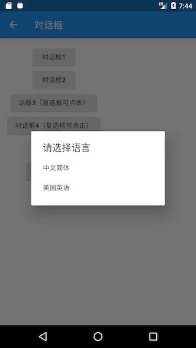
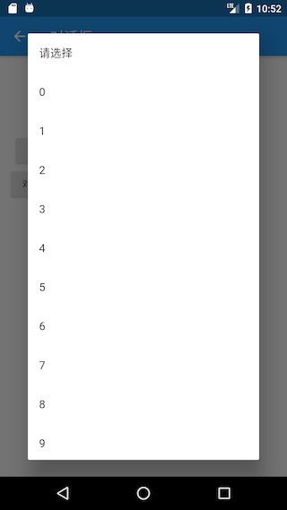
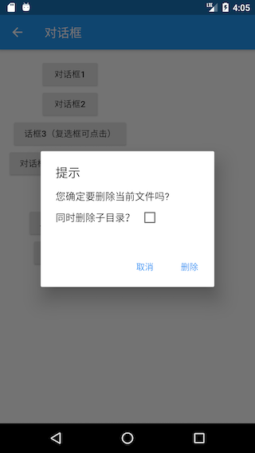
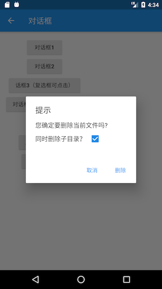
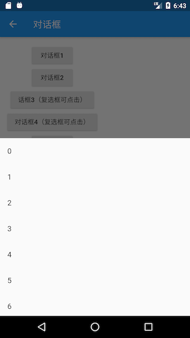
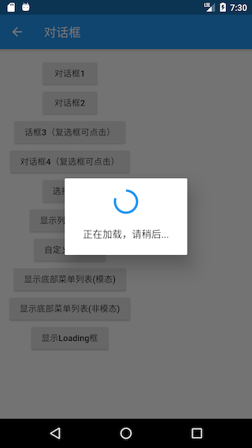

# 7.6 对话框详解

本节将详细介绍一下Flutter中对话框的使用方式、实现原理、样式定制及状态管理。

## 7.6.1 使用对话框

对话框本质上也是UI布局，通常一个对话框会包含标题、内容，以及一些操作按钮，为此，Material库中提供了一些现成的对话框组件来用于快速的构建出一个完整的对话框。

### AlertDialog

下面我们主要介绍一下Material库中的`AlertDialog`组件，它的构造函数定义如下：

```dart
const AlertDialog({
  Key key,
  this.title, //对话框标题组件
  this.titlePadding, // 标题填充
  this.titleTextStyle, //标题文本样式
  this.content, // 对话框内容组件
  this.contentPadding = const EdgeInsets.fromLTRB(24.0, 20.0, 24.0, 24.0), //内容的填充
  this.contentTextStyle,// 内容文本样式
  this.actions, // 对话框操作按钮组
  this.backgroundColor, // 对话框背景色
  this.elevation,// 对话框的阴影
  this.semanticLabel, //对话框语义化标签(用于读屏软件)
  this.shape, // 对话框外形
})
```

参数都比较简单，不在赘述。下面我们看一个例子，假如我们要在删除文件时弹出一个确认对话框，该对话框如图7-10所示：


该对话框样式代码如下：

```dart
AlertDialog(
  title: Text("提示"),
  content: Text("您确定要删除当前文件吗?"),
  actions: <Widget>[
    FlatButton(
      child: Text("取消"),
      onPressed: () => Navigator.of(context).pop(), //关闭对话框
    ),
    FlatButton(
      child: Text("删除"),
      onPressed: () {
        // ... 执行删除操作
        Navigator.of(context).pop(true); //关闭对话框
      },
    ),
  ],
);
```

实现代码很简单，不在赘述。唯一需要注意的是我们是通过`Navigator.of(context).pop(…)`方法来关闭对话框的，这和路由返回的方式是一致的，并且都可以返回一个结果数据。现在，对话框我们已经构建好了，那么如何将它弹出来呢？还有对话框返回的数据应如何被接收呢？这些问题的答案都在`showDialog()`方法中。

`showDialog()`是Material组件库提供的一个用于弹出Material风格对话框的方法，签名如下：

```dart
Future<T> showDialog<T>({
  @required BuildContext context,
  bool barrierDismissible = true, //点击对话框barrier(遮罩)时是否关闭它
  WidgetBuilder builder, // 对话框UI的builder
})
```

该方法只有两个参数，含义见注释。该方法返回一个`Future`，它正是用于接收对话框的返回值：如果我们是通过点击对话框遮罩关闭的，则`Future`的值为`null`，否则为我们通过`Navigator.of(context).pop(result)`返回的result值，下面我们看一下整个示例：

```dart
//点击该按钮后弹出对话框
RaisedButton(
  child: Text("对话框1"),
  onPressed: () async {
    //弹出对话框并等待其关闭
    bool delete = await showDeleteConfirmDialog1();
    if (delete == null) {
      print("取消删除");
    } else {
      print("已确认删除");
      //... 删除文件
    }
  },
),

// 弹出对话框
Future<bool> showDeleteConfirmDialog1() {
  return showDialog<bool>(
    context: context,
    builder: (context) {
      return AlertDialog(
        title: Text("提示"),
        content: Text("您确定要删除当前文件吗?"),
        actions: <Widget>[
          FlatButton(
            child: Text("取消"),
            onPressed: () => Navigator.of(context).pop(), // 关闭对话框
          ),
          FlatButton(
            child: Text("删除"),
            onPressed: () {
              //关闭对话框并返回true
              Navigator.of(context).pop(true);
            },
          ),
        ],
      );
    },
  );
}
```

示例运行后，我们点击对话框“取消”按钮或遮罩，控制台就会输出"取消删除"，如果点击“删除”按钮，控制台就会输出"已确认删除"。

> 注意：如果`AlertDialog`的内容过长，内容将会溢出，这在很多时候可能不是我们期望的，所以如果对话框内容过长时，可以用`SingleChildScrollView`将内容包裹起来。

### SimpleDialog

`SimpleDialog`也是Material组件库提供的对话框，它会展示一个列表，用于列表选择的场景。下面是一个选择APP语言的示例，运行结果如图7-11。



实现代码如下：

```dart
Future<void> changeLanguage() async {
  int i = await showDialog<int>(
      context: context,
      builder: (BuildContext context) {
        return SimpleDialog(
          title: const Text('请选择语言'),
          children: <Widget>[
            SimpleDialogOption(
              onPressed: () {
                // 返回1
                Navigator.pop(context, 1);
              },
              child: Padding(
                padding: const EdgeInsets.symmetric(vertical: 6),
                child: const Text('中文简体'),
              ),
            ),
            SimpleDialogOption(
              onPressed: () {
                // 返回2
                Navigator.pop(context, 2);
              },
              child: Padding(
                padding: const EdgeInsets.symmetric(vertical: 6),
                child: const Text('美国英语'),
              ),
            ),
          ],
        );
      });

  if (i != null) {
    print("选择了：${i == 1 ? "中文简体" : "美国英语"}");
  }
}
```

列表项组件我们使用了`SimpleDialogOption`组件来包装了一下，它相当于一个FlatButton，只不过按钮文案是左对齐的，并且padding较小。上面示例运行后，用户选择一种语言后，控制台就会打印出它。

### Dialog

实际上`AlertDialog`和`SimpleDialog`都使用了`Dialog`类。由于`AlertDialog`和`SimpleDialog`中使用了`IntrinsicWidth`来尝试通过子组件的实际尺寸来调整自身尺寸，这就导致他们的子组件不能是延迟加载模型的组件（如`ListView`、`GridView` 、 `CustomScrollView`等），如下面的代码运行后会报错。

```dart
AlertDialog(
  content: ListView(
    children: ...//省略
  ),
);
```

如果我们就是需要嵌套一个`ListView`应该怎么做？这时，我们可以直接使用`Dialog`类，如：

```dart
Dialog(
  child: ListView(
    children: ...//省略
  ),
);
```

下面我们看一个弹出一个有30个列表项的对话框示例，运行效果如图7-12所示：



实现代码如下：

```dart
Future<void> showListDialog() async {
  int index = await showDialog<int>(
    context: context,
    builder: (BuildContext context) {
      var child = Column(
        children: <Widget>[
          ListTile(title: Text("请选择")),
          Expanded(
              child: ListView.builder(
            itemCount: 30,
            itemBuilder: (BuildContext context, int index) {
              return ListTile(
                title: Text("$index"),
                onTap: () => Navigator.of(context).pop(index),
              );
            },
          )),
        ],
      );
      //使用AlertDialog会报错
      //return AlertDialog(content: child);
      return Dialog(child: child);
    },
  );
  if (index != null) {
    print("点击了：$index");
  }
}
```

现在，我们己经介绍完了`AlertDialog`、`SimpleDialog`以及`Dialog`。上面的示例中，我们在调用`showDialog`时，在`builder`中都是构建了这三个对话框组件的一种，可能有些读者会惯性的以为在`builder`中只能返回这三者之一，其实这不是必须的！就拿`Dialog`的示例来举例，我们完全可以用下面的代码来替代`Dialog`：

```dart
// return Dialog(child: child) 
return UnconstrainedBox(
  constrainedAxis: Axis.vertical,
  child: ConstrainedBox(
    constraints: BoxConstraints(maxWidth: 280),
    child: Material(
      child: child,
      type: MaterialType.card,
    ),
  ),
);
```

上面代码运行后可以实现一样的效果。现在我们总结一下：`AlertDialog`、`SimpleDialog`以及`Dialog`是Material组件库提供的三种对话框，旨在帮助开发者快速构建出符合Material设计规范的对话框，但读者完全可以自定义对话框样式，因此，我们仍然可以实现各种样式的对话框，这样即带来了易用性，又有很强的扩展性。

## 7.6.2 对话框打开动画及遮罩

我们可以把对话框分为内部样式和外部样式两部分。内部样式指对话框中显示的具体内容，这部分内容我们已经在上面介绍过了；外部样式包含对话框遮罩样式、打开动画等，本节主要介绍如何自定义这些外部样式。

> 关于动画相关内容我们将在本书后面章节介绍，下面内容读者可以先了解一下（不必深究），读者可以在学习完动画相关内容后再回头来看。

我们已经介绍过了`showDialog`方法，它是Material组件库中提供的一个打开Material风格对话框的方法。那如何打开一个普通风格的对话框呢（非Material风格）？ Flutter 提供了一个`showGeneralDialog`方法，签名如下：

```dart
Future<T> showGeneralDialog<T>({
  @required BuildContext context,
  @required RoutePageBuilder pageBuilder, //构建对话框内部UI
  bool barrierDismissible, //点击遮罩是否关闭对话框
  String barrierLabel, // 语义化标签(用于读屏软件)
  Color barrierColor, // 遮罩颜色
  Duration transitionDuration, // 对话框打开/关闭的动画时长
  RouteTransitionsBuilder transitionBuilder, // 对话框打开/关闭的动画
})
```

实际上，`showDialog`方法正是`showGeneralDialog`的一个封装，定制了Material风格对话框的遮罩颜色和动画。Material风格对话框打开/关闭动画是一个Fade（渐隐渐显）动画，如果我们想使用一个缩放动画就可以通过`transitionBuilder`来自定义。下面我们自己封装一个`showCustomDialog`方法，它定制的对话框动画为缩放动画，并同时制定遮罩颜色为`Colors.black87`：

```dart
Future<T> showCustomDialog<T>({
  @required BuildContext context,
  bool barrierDismissible = true,
  WidgetBuilder builder,
}) {
  final ThemeData theme = Theme.of(context, shadowThemeOnly: true);
  return showGeneralDialog(
    context: context,
    pageBuilder: (BuildContext buildContext, Animation<double> animation,
        Animation<double> secondaryAnimation) {
      final Widget pageChild = Builder(builder: builder);
      return SafeArea(
        child: Builder(builder: (BuildContext context) {
          return theme != null
              ? Theme(data: theme, child: pageChild)
              : pageChild;
        }),
      );
    },
    barrierDismissible: barrierDismissible,
    barrierLabel: MaterialLocalizations.of(context).modalBarrierDismissLabel,
    barrierColor: Colors.black87, // 自定义遮罩颜色
    transitionDuration: const Duration(milliseconds: 150),
    transitionBuilder: _buildMaterialDialogTransitions,
  );
}

Widget _buildMaterialDialogTransitions(
    BuildContext context,
    Animation<double> animation,
    Animation<double> secondaryAnimation,
    Widget child) {
  // 使用缩放动画
  return ScaleTransition(
    scale: CurvedAnimation(
      parent: animation,
      curve: Curves.easeOut,
    ),
    child: child,
  );
}
```

现在，我们使用`showCustomDialog`打开文件删除确认对话框，代码如下：

```dart
... //省略无关代码
showCustomDialog<bool>(
  context: context,
  builder: (context) {
    return AlertDialog(
      title: Text("提示"),
      content: Text("您确定要删除当前文件吗?"),
      actions: <Widget>[
        FlatButton(
          child: Text("取消"),
          onPressed: () => Navigator.of(context).pop(),
        ),
        FlatButton(
          child: Text("删除"),
          onPressed: () {
            // 执行删除操作
            Navigator.of(context).pop(true);
          },
        ),
      ],
    );
  },
);
```

运行效果如图7-13所示：


可以发现，遮罩颜色比通过`showDialog`方法打开的对话框更深。另外对话框打开/关闭的动画已变为缩放动画了，读者可以亲自运行示例查看效果。

## 7.6.3 对话框实现原理

我们已经知道对话框最终都是由`showGeneralDialog`方法打开的，我们来看看它的具体实现：

```dart
Future<T> showGeneralDialog<T>({
  @required BuildContext context,
  @required RoutePageBuilder pageBuilder,
  bool barrierDismissible,
  String barrierLabel,
  Color barrierColor,
  Duration transitionDuration,
  RouteTransitionsBuilder transitionBuilder,
}) {
  return Navigator.of(context, rootNavigator: true).push<T>(_DialogRoute<T>(
    pageBuilder: pageBuilder,
    barrierDismissible: barrierDismissible,
    barrierLabel: barrierLabel,
    barrierColor: barrierColor,
    transitionDuration: transitionDuration,
    transitionBuilder: transitionBuilder,
  ));
}
```

实现很简单，直接调用`Navigator`的`push`方法打开了一个新的对话框路由`_DialogRoute`，然后返回了`push`的返回值。可见对话框实际上正是通过路由的形式实现的，这也是为什么我们可以使用`Navigator`的`pop` 方法来退出对话框的原因。关于对话框的样式定制在`_DialogRoute`中，没有什么新的东西，读者可以自行查看。

## 7.6.4 对话框状态管理

我们在用户选择删除一个文件时，会询问是否删除此文件；在用户选择一个文件夹是，应该再让用户确认是否删除子文件夹。为了在用户选择了文件夹时避免二次弹窗确认是否删除子目录，我们在确认对话框底部添加一个“同时删除子目录？”的复选框，如图7-14所示：




现在就有一个问题：如何管理复选框的选中状态？习惯上，我们会在路由页的State中来管理选中状态，我们可能会写出如下这样的代码：

```dart
class _DialogRouteState extends State<DialogRoute> {
  bool withTree = false; // 复选框选中状态

  @override
  Widget build(BuildContext context) {
    return Column(
      children: <Widget>[
        RaisedButton(
          child: Text("对话框2"),
          onPressed: () async {
            bool delete = await showDeleteConfirmDialog2();
            if (delete == null) {
              print("取消删除");
            } else {
              print("同时删除子目录: $delete");
            }
          },
        ),
      ],
    );
  }

  Future<bool> showDeleteConfirmDialog2() {
    withTree = false; // 默认复选框不选中
    return showDialog<bool>(
      context: context,
      builder: (context) {
        return AlertDialog(
          title: Text("提示"),
          content: Column(
            crossAxisAlignment: CrossAxisAlignment.start,
            mainAxisSize: MainAxisSize.min,
            children: <Widget>[
              Text("您确定要删除当前文件吗?"),
              Row(
                children: <Widget>[
                  Text("同时删除子目录？"),
                  Checkbox(
                    value: withTree,
                    onChanged: (bool value) {
                      //复选框选中状态发生变化时重新构建UI
                      setState(() {
                        //更新复选框状态
                        withTree = !withTree;
                      });
                    },
                  ),
                ],
              ),
            ],
          ),
          actions: <Widget>[
            FlatButton(
              child: Text("取消"),
              onPressed: () => Navigator.of(context).pop(),
            ),
            FlatButton(
              child: Text("删除"),
              onPressed: () {
                //执行删除操作
                Navigator.of(context).pop(withTree);
              },
            ),
          ],
        );
      },
    );
  }
}
```

然后，当我们运行上面的代码时我们会发现复选框根本选不中！为什么会这样呢？其实原因很简单，我们知道`setState`方法只会针对当前context的子树重新build，但是我们的对话框并不是在`_DialogRouteState`的`build` 方法中构建的，而是通过`showDialog`单独构建的，所以调用在`_DialogRouteState`的context中调用`setState`是无法影响通过`showDialog`构建的UI的。另外，我们可以从另外一个角度来理解这个现象，前面说过对话框也是通过路由的方式来实现的，那么上面的代码实际上就等同于企图在父路由中调用`setState`来让子路由更新，这显然是不行的！简尔言之，根本原因就是context不对。那如何让复选框可点击呢？通常有如下三种方法：

### 单独抽离出StatefulWidget

既然是context不对，那么直接的思路就是将复选框的选中逻辑单独封装成一个`StatefulWidget`，然后在其内部管理复选状态。我们先来看看这种方法，下面是实现代码：

```dart
// 单独封装一个内部管理选中状态的复选框组件
class DialogCheckbox extends StatefulWidget {
  DialogCheckbox({
    Key key,
    this.value,
    @required this.onChanged,
  });

  final ValueChanged<bool> onChanged;
  final bool value;

  @override
  _DialogCheckboxState createState() => _DialogCheckboxState();
}

class _DialogCheckboxState extends State<DialogCheckbox> {
  bool value;

  @override
  void initState() {
    value = widget.value;
    super.initState();
  }

  @override
  Widget build(BuildContext context) {
    return Checkbox(
      value: value,
      onChanged: (v) {
        //将选中状态通过事件的形式抛出
        widget.onChanged(v);
        setState(() {
          //更新自身选中状态
          value = v;
        });
      },
    );
  }
}
```

下面是弹出对话框的代码：

```dart
Future<bool> showDeleteConfirmDialog3() {
  bool _withTree = false; //记录复选框是否选中
  return showDialog<bool>(
    context: context,
    builder: (context) {
      return AlertDialog(
        title: Text("提示"),
        content: Column(
          crossAxisAlignment: CrossAxisAlignment.start,
          mainAxisSize: MainAxisSize.min,
          children: <Widget>[
            Text("您确定要删除当前文件吗?"),
            Row(
              children: <Widget>[
                Text("同时删除子目录？"),
                DialogCheckbox(
                  value: _withTree, //默认不选中
                  onChanged: (bool value) {
                    //更新选中状态
                    _withTree = !_withTree;
                  },
                ),
              ],
            ),
          ],
        ),
        actions: <Widget>[
          FlatButton(
            child: Text("取消"),
            onPressed: () => Navigator.of(context).pop(),
          ),
          FlatButton(
            child: Text("删除"),
            onPressed: () {
              // 将选中状态返回
              Navigator.of(context).pop(_withTree);
            },
          ),
        ],
      );
    },
  );
}
```

最后，就是使用：

```dart
RaisedButton(
  child: Text("话框3（复选框可点击）"),
  onPressed: () async {
    //弹出删除确认对话框，等待用户确认
    bool deleteTree = await showDeleteConfirmDialog3();
    if (deleteTree == null) {
      print("取消删除");
    } else {
      print("同时删除子目录: $deleteTree");
    }
  },
),
```

运行后效果如图7-15所示：



可见复选框能选中了，点击“取消”或“删除”后，控制台就会打印出最终的确认状态。

### 使用StatefulBuilder方法

上面的方法虽然能解决对话框状态更新的问题，但是有一个明显的缺点——对话框上所有需要会改变状态的组件都得单独封装在一个在内部管理状态`StatefulWidget`中，这样不仅麻烦，而且复用性不大。因此，我们来想想能不能找到一种更简单的方法？上面的方法本质上就是将对话框的状态置于一个`StatefulWidget`的上下文中，由`StatefulWidget`在内部管理，那么我们有没有办法在不需要单独抽离组件的情况下创建一个`StatefulWidget`的上下文呢？想到这里，我们可以从`Builder`组件的实现获得灵感。在前面介绍过`Builder`组件可以获得组件所在位置的真正的Context，那它是怎么实现的呢，我们看看它的源码：

```dart
class Builder extends StatelessWidget {
  const Builder({
    Key key,
    @required this.builder,
  }) : assert(builder != null),
       super(key: key);
  final WidgetBuilder builder;

  @override
  Widget build(BuildContext context) => builder(context);
}
```

可以看到，`Builder`实际上只是继承了`StatelessWidget`，然后在`build`方法中获取当前context后将构建方法代理到了`builder`回调，可见，`Builder`实际上是获取了`StatelessWidget` 的上下文（context）。那么我们能否用相同的方法获取`StatefulWidget` 的上下文，并代理其`build`方法呢？下面我们照猫画虎，来封装一个`StatefulBuilder`方法：

```dart
class StatefulBuilder extends StatefulWidget {
  const StatefulBuilder({
    Key key,
    @required this.builder,
  }) : assert(builder != null),
       super(key: key);

  final StatefulWidgetBuilder builder;

  @override
  _StatefulBuilderState createState() => _StatefulBuilderState();
}

class _StatefulBuilderState extends State<StatefulBuilder> {
  @override
  Widget build(BuildContext context) => widget.builder(context, setState);
}
```

代码很简单，`StatefulBuilder`获取了`StatefulWidget`的上下文，并代理了其构建过程。下面我们就可以通过`StatefulBuilder`来重构上面的代码了（变动只在`DialogCheckbox`部分）：

```dart
... //省略无关代码
Row(
  children: <Widget>[
    Text("同时删除子目录？"),
    //使用StatefulBuilder来构建StatefulWidget上下文
    StatefulBuilder(
      builder: (context, _setState) {
        return Checkbox(
          value: _withTree, //默认不选中
          onChanged: (bool value) {
            //_setState方法实际就是该StatefulWidget的setState方法，
            //调用后builder方法会重新被调用
            _setState(() {
              //更新选中状态
              _withTree = !_withTree;
            });
          },
        );
      },
    ),
  ],
),
```

实际上，这种方法本质上就是子组件通知父组件（StatefulWidget）重新build子组件本身来实现UI更新的，读者可以对比代码理解。实际上`StatefulBuilder`正是Flutter SDK中提供的一个类，它和`Builder`的原理是一样的，在此，提醒读者一定要将`StatefulBuilder`和`Builder`理解透彻，因为它们在Flutter中是非常实用的。

### 精妙的解法

要确认这个问题，我们就得先想想UI是怎么更新的，我们知道在调用`setState`方法后`StatefulWidget`就会重新build，那`setState`方法做了什么呢？我们能不能从中找到方法？顺着这个思路，我们就得看一下`setState`的核心源码：

```dart
void setState(VoidCallback fn) {
  ... //省略无关代码
  _element.markNeedsBuild();
}
```

可以发现，`setState`中调用了`Element`的`markNeedsBuild()`方法，我们前面说过，Flutter是一个响应式框架，要更新UI只需改变状态后通知框架页面需要重构即可，而`Element`的`markNeedsBuild()`方法正是来实现这个功能的！`markNeedsBuild()`方法会将当前的`Element`对象标记为“dirty”（脏的），在每一个Frame，Flutter都会重新构建被标记为“dirty”`Element`对象。既然如此，我们有没有办法获取到对话框内部UI的`Element`对象，然后将其标示为为“dirty”呢？答案是肯定的！我们可以通过Context来得到`Element`对象，至于`Element`与`Context`的关系我们将会在后面“Flutter核心原理”一章中再深入介绍，现在只需要简单的认为：在组件树中，`context`实际上就是`Element`对象的引用。知道这个后，那么解决的方案就呼之欲出了，我们可以通过如下方式来让复选框可以更新：

```dart
Future<bool> showDeleteConfirmDialog4() {
  bool _withTree = false;
  return showDialog<bool>(
    context: context,
    builder: (context) {
      return AlertDialog(
        title: Text("提示"),
        content: Column(
          crossAxisAlignment: CrossAxisAlignment.start,
          mainAxisSize: MainAxisSize.min,
          children: <Widget>[
            Text("您确定要删除当前文件吗?"),
            Row(
              children: <Widget>[
                Text("同时删除子目录？"),
                Checkbox( // 依然使用Checkbox组件
                  value: _withTree,
                  onChanged: (bool value) {
                    // 此时context为对话框UI的根Element，我们 
                    // 直接将对话框UI对应的Element标记为dirty
                    (context as Element).markNeedsBuild();
                    _withTree = !_withTree;
                  },
                ),
              ],
            ),
          ],
        ),
        actions: <Widget>[
          FlatButton(
            child: Text("取消"),
            onPressed: () => Navigator.of(context).pop(),
          ),
          FlatButton(
            child: Text("删除"),
            onPressed: () {
              // 执行删除操作
              Navigator.of(context).pop(_withTree);
            },
          ),
        ],
      );
    },
  );
}
```

上面的代码运行后复选框也可以正常选中。可以看到，我们只用了一行代码便解决了这个问题！当然上面的代码并不是最优，因为我们只需要更新复选框的状态，而此时的`context`我们用的是对话框的根`context`，所以会导致整个对话框UI组件全部rebuild，因此最好的做法是将`context`的“范围”缩小，也就是说只将`Checkbox`的Element标记为`dirty`，优化后的代码为：

```dart
... //省略无关代码
Row(
  children: <Widget>[
    Text("同时删除子目录？"),
    // 通过Builder来获得构建Checkbox的`context`，
    // 这是一种常用的缩小`context`范围的方式
    Builder(
      builder: (BuildContext context) {
        return Checkbox(
          value: _withTree,
          onChanged: (bool value) {
            (context as Element).markNeedsBuild();
            _withTree = !_withTree;
          },
        );
      },
    ),
  ],
),
```

## 7.6.5 其它类型的对话框

### 底部菜单列表

`showModalBottomSheet`方法可以弹出一个Material风格的底部菜单列表模态对话框，示例如下：

```dart
// 弹出底部菜单列表模态对话框
Future<int> _showModalBottomSheet() {
  return showModalBottomSheet<int>(
    context: context,
    builder: (BuildContext context) {
      return ListView.builder(
        itemCount: 30,
        itemBuilder: (BuildContext context, int index) {
          return ListTile(
            title: Text("$index"),
            onTap: () => Navigator.of(context).pop(index),
          );
        },
      );
    },
  );
}
```

点击按钮，弹出该对话框：

```dart
RaisedButton(
  child: Text("显示底部菜单列表"),
  onPressed: () async {
    int type = await _showModalBottomSheet();
    print(type);
  },
),
```

运行后效果如图7-16所示：



`showModalBottomSheet`的实现原理和`showGeneralDialog`实现原理相同，都是通过路由的方式来实现的，读者可以查看源码对比。但值得一提的是还有一个`showBottomSheet`方法，该方法会从设备底部向上弹出一个全屏的菜单列表，示例如下：

```dart
// 返回的是一个controller
PersistentBottomSheetController<int> _showBottomSheet() {
  return showBottomSheet<int>(
    context: context,
    builder: (BuildContext context) {
      return ListView.builder(
        itemCount: 30,
        itemBuilder: (BuildContext context, int index) {
          return ListTile(
            title: Text("$index"),
            onTap: (){
              // do something
              print("$index");
              Navigator.of(context).pop();
            },
          );
        },
      );
    },
  );
}
```

运行效果如图7-17所示：


`PersistentBottomSheetController`中包含了一些控制对话框的方法比如`close`方法可以关闭该对话框，功能比较简单，读者可以自行查看源码。唯一需要注意的是，`showBottomSheet`和我们上面介绍的弹出对话框的方法原理不同：`showBottomSheet`是调用widget树顶部的`Scaffold`组件的`ScaffoldState `的`showBottomSheet`同名方法实现，也就是说要调用`showBottomSheet`方法就必须得保证父级组件中有`Scaffold`。

### Loading框

其实Loading框可以直接通过`showDialog`+`AlertDialog`来自定义：

```dart
showLoadingDialog() {
  showDialog(
    context: context,
    barrierDismissible: false, //点击遮罩不关闭对话框
    builder: (context) {
      return AlertDialog(
        content: Column(
          mainAxisSize: MainAxisSize.min,
          children: <Widget>[
            CircularProgressIndicator(),
            Padding(
              padding: const EdgeInsets.only(top: 26.0),
              child: Text("正在加载，请稍后..."),
            )
          ],
        ),
      );
    },
  );
}
```

显示效果如图7-18所示：


如果我们嫌Loading框太宽，想自定义对话框宽度，这时只使用`SizedBox`或`ConstrainedBox`是不行的，原因是`showDialog`中已经给对话框设置了宽度限制，根据我们在第五章“尺寸限制类容器”一节中所述，我们可以使用`UnconstrainedBox`先抵消`showDialog`对宽度的限制，然后再使用`SizedBox`指定宽度，代码如下：

```dart
... //省略无关代码
UnconstrainedBox(
  constrainedAxis: Axis.vertical,
  child: SizedBox(
    width: 280,
    child: AlertDialog(
      content: Column(
        mainAxisSize: MainAxisSize.min,
        children: <Widget>[
          CircularProgressIndicator(value: .8,),
          Padding(
            padding: const EdgeInsets.only(top: 26.0),
            child: Text("正在加载，请稍后..."),
          )
        ],
      ),
    ),
  ),
);
```

代码运行后，效果如图7-19所示：



### 日历选择

我们先看一下Material风格的日历选择器，如图7-20所示：


实现代码：

```dart
Future<DateTime> _showDatePicker1() {
  var date = DateTime.now();
  return showDatePicker(
    context: context,
    initialDate: date,
    firstDate: date,
    lastDate: date.add( //未来30天可选
      Duration(days: 30),
    ),
  );
}
```

iOS风格的日历选择器需要使用`showCupertinoModalPopup`方法和`CupertinoDatePicker`组件来实现：

```dart
Future<DateTime> _showDatePicker2() {
  var date = DateTime.now();
  return showCupertinoModalPopup(
    context: context,
    builder: (ctx) {
      return SizedBox(
        height: 200,
        child: CupertinoDatePicker(
          mode: CupertinoDatePickerMode.dateAndTime,
          minimumDate: date,
          maximumDate: date.add(
            Duration(days: 30),
          ),
          maximumYear: date.year + 1,
          onDateTimeChanged: (DateTime value) {
            print(value);
          },
        ),
      );
    },
  );
}
```

运行效果如图7-21所示：


